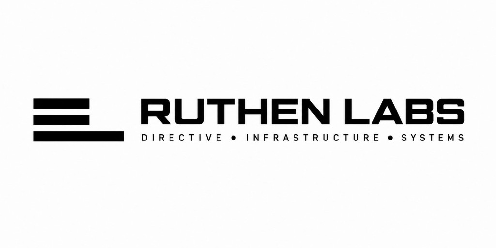

<div align="center">
  
</div>

```text
______       _   _                  _           _         
| ___ \     | | | |                | |         | |        
| |_/ /_   _| |_| |__   ___ _ __   | |     __ _| |__  ___ 
|    /| | | | __| '_ \ / _ \ '_ \  | |    / _` | '_ \/ __|
| |\ \| |_| | |_| | | |  __/ | | | | |___| (_| | |_) \__ \
\_| \_|\__,_|\__|_| |_|\___|_| |_| \_____/\__,_|_.__/|___/
```

# Ruthen Labs

> **"What runs here, stays here."**

## Description
A sovereign, local-first AI development environment and infrastructure replacing cloud wrappers. Built for privacy, speed, and absolute control over your AI agents and tools.

## Architecture

| Component | Technology | Description |
|-----------|------------|-------------|
| **sandbox** | Rust/Sandbox | Security Sandbox for executing AI-generated or untrusted code safely. |
| **indexer** | Rust/Indexer | Ultra-fast Codebase Indexer for parsing and managing local workspace knowledge. |
| **orchestrator** | Go/Orchestrator | AI Orchestrator that coordinates agents, tasks, and system interactions. |

## Quickstart

### Prerequisites
- Rust (`rustup default stable`)
- Go 1.21+

### Setup
1. **Clone the repository:**
   ```bash
   git clone <your-repo-url>
   cd Ruthen-Labs
   ```
2. **Review contribution guidelines:**
   Before making changes, please read [CONTRIBUTING.md](./CONTRIBUTING.md) to understand our strict DCO and PR rules.
3. **Run CI locally:**
   - **Rust modules (`sandbox`, `indexer`):**
     ```bash
     cd <module-name>
     cargo fmt --all -- --check
     cargo clippy -- -D warnings
     cargo test
     ```
   - **Go modules (`orchestrator`):**
     ```bash
     cd orchestrator
     go fmt ./...
     go vet ./...
     go test -v ./...
     ```

## License
Licensed under the [GNU AGPL 3.0](./LICENSE). See the LICENSE file for details.
